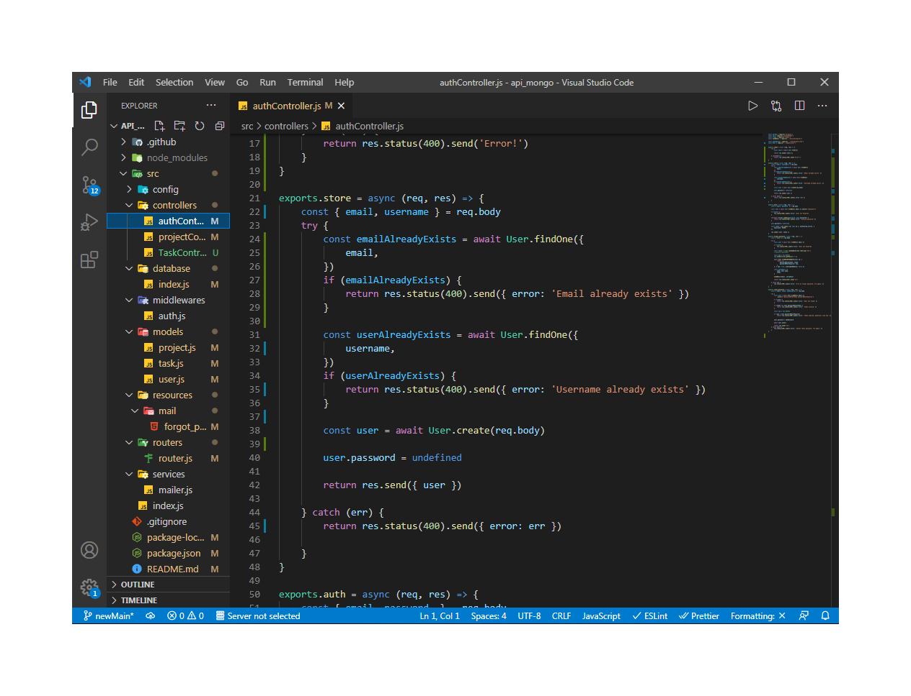

<h1 >
    Project-Tasks
</h1>

<div align="center">
     
</div>

---

<p align="center" target="_blank">
    Made with 💜 by Vinicius Jose
</p>

# Technologies Used
<p>
    This project was developed with the following technologies:
</p>

- Javascript
- Express
- bcryptjs
- bootstramp
- Nodemailer
- MongoDB
- Mongoose

## 🔥 The Project
<p>
    The project is limited to an application for creating and managing projects, to assist in the development and organization of a team in a given project. Not only that, but also to help me with studies on backend and mongodb and jwt and also to reinforce my knowledge in sending Emails.
</p>

# ☕ Description
I developed this api to improve my knowledge in authentication and mongodb and jwt and maybe someday build a front-end application to consume this api.

This application was developed in javascript with the following technologies, express, bcryptjs, Nodemailer and MongoDB as a database. I built the following controls and models in this project, User, Projects, Tasks, I also used some validations from Mongoose itself, to validate some input data. I used jsonwebtoken to authenticate the user's routes and login. I used Nodemailer for the "Forget Password" option for the user.

The idea in general was to build a back-end, for a project that would facilitate the creation of projects and the management and communication between users. when the project starts by sending an email and sending it to each member of the project, talking about their respective tasks.

# Executing the Project

#### Cloning the project

```javascript
    $ git clone https://github.com/zV1N1/api-projectTask.git

    # Go into the repository
    $ cd api_mongo

    # Install dependencies
    $ npm install

    # Run the app
    $ npm start
```

#### Starting the Project

```bash
    # Run the app
    $ npm start
```

---

<h4 align="center"> <em>&lt;/&gt;</em> by <a href="https://github.com/zV1N1" target="_blank">zV1N1</a> </h4>

